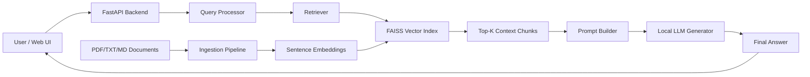

# Simple Architecture Overview

This is a quick explanation of how your project works.

## 1. Architecture Diagram

## 2. Simple Flow
1. You upload documents (`PDF/TXT/MD`) to `data/raw/`.
2. Ingestion script reads documents, splits into chunks, and creates embeddings.
3. Embeddings are stored in FAISS index for fast similarity search.
4. User asks a question from web UI or API.
5. System retrieves top relevant chunks from FAISS.
6. Retrieved chunks are added to prompt.
7. Local LLM generates grounded answer.
8. API returns answer, latency, and retrieved context.

## 3. Two Modes
- `baseline`: LLM answers directly without retrieval.
- `rag`: LLM answers with retrieved document context.

## 4. Why This Reduces Hallucination
RAG provides evidence from your documents before generation, so answers are more factual and less fabricated than baseline mode.

## 5. Key Files
- Backend: `src/main.py`
- Ingestion: `src/ingestion.py`
- Retrieval: `src/retrieval.py`
- RAG pipeline: `src/rag_pipeline.py`
- Web UI: `web/index.html`
